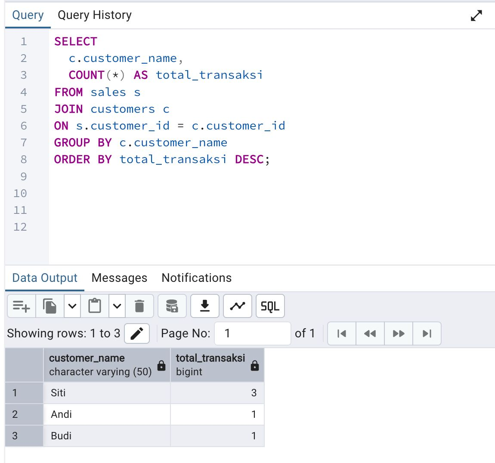
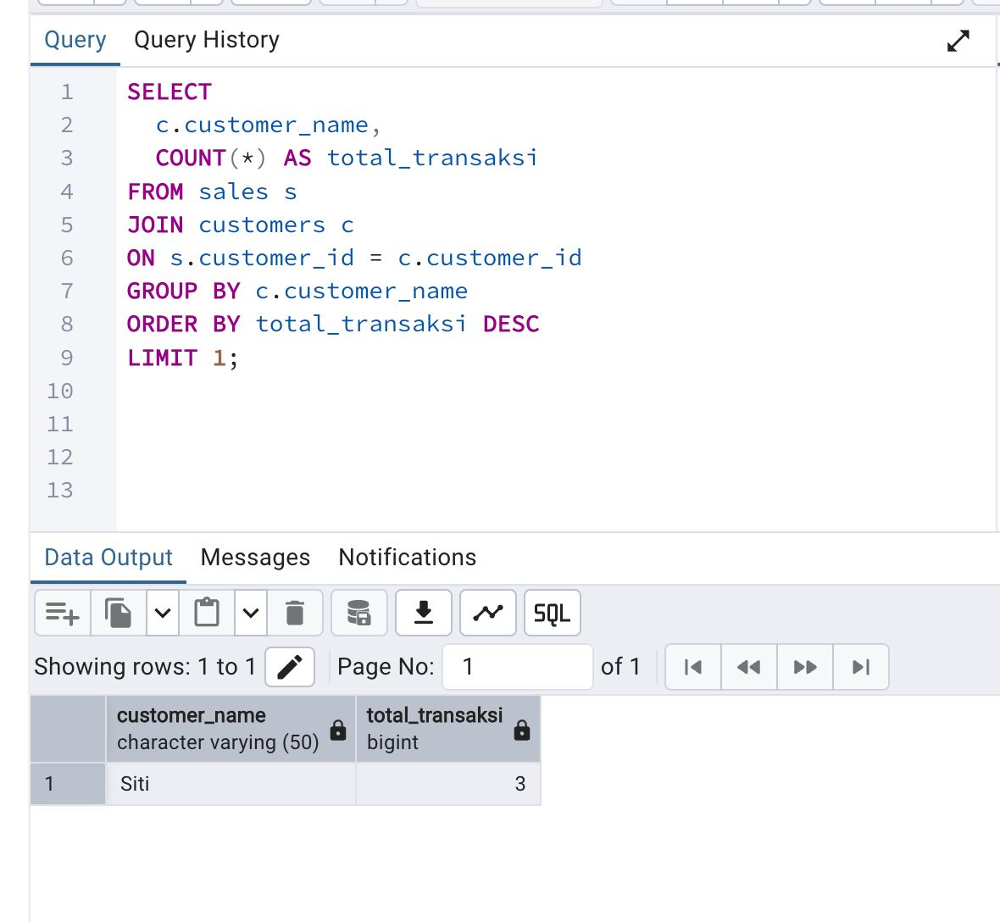
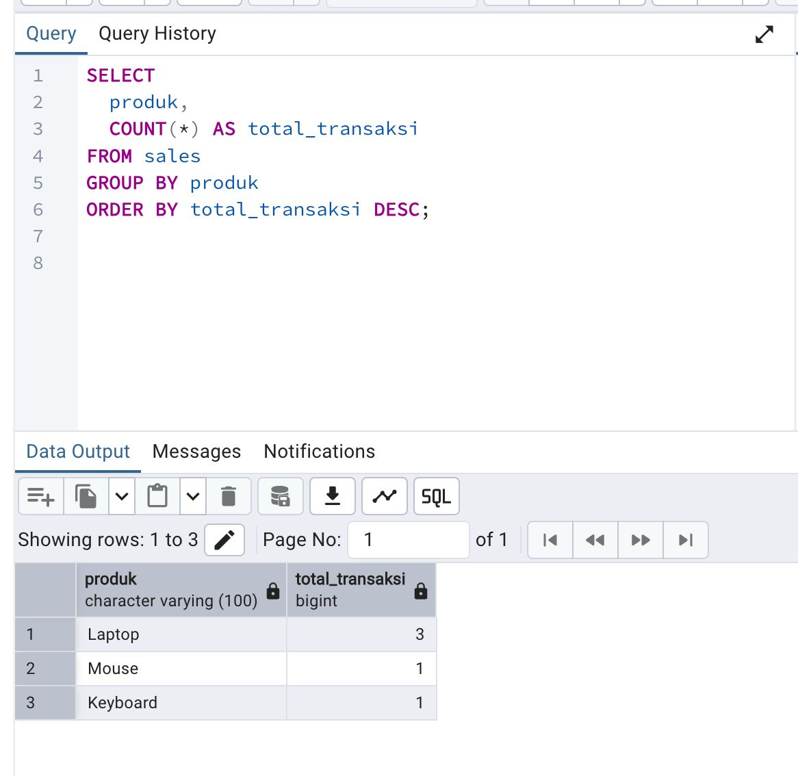
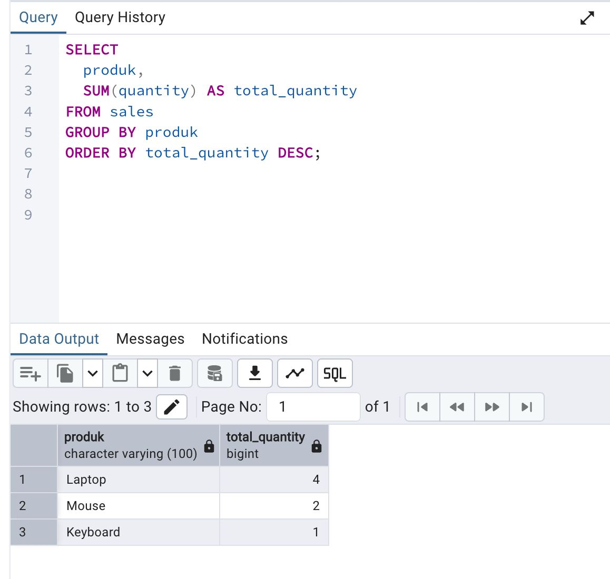
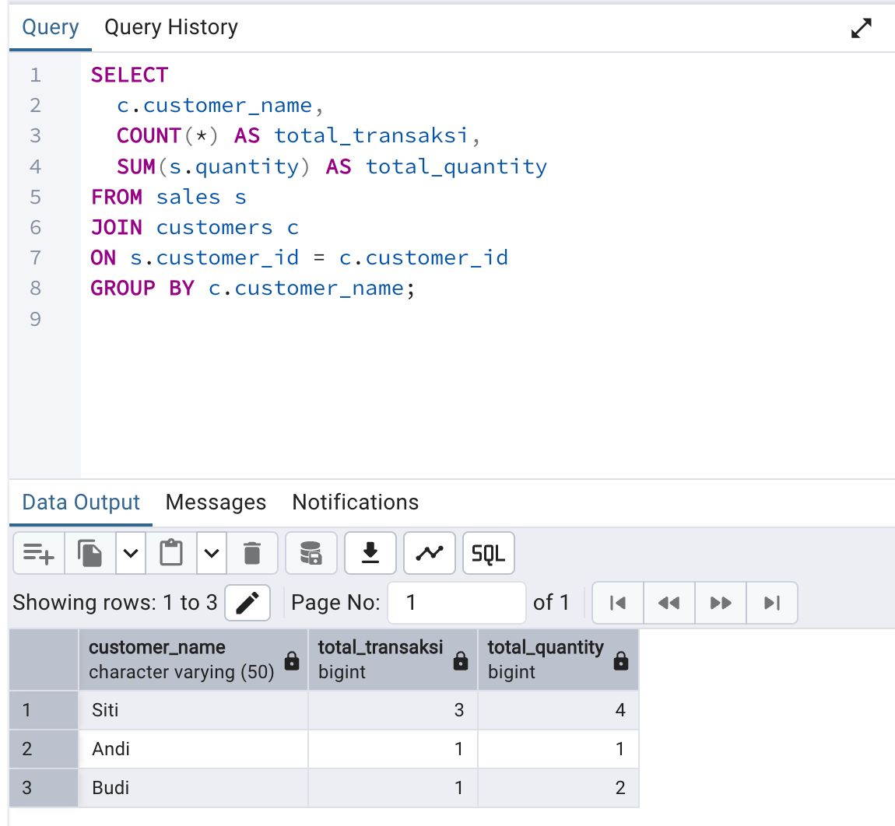

# Sales Performance Analysis

## Background
This project analyzes sales transactions to understand customer behavior
and product performance using SQL.

## Database Tables
- sales
- customers

## Analysis Performed
1. Total transactions per customer
2. Top-selling product based on number of transactions

## SQL Techniques Used
- JOIN
- GROUP BY
- COUNT
- ORDER BY
- LIMIT

## Tools
- PostgreSQL
- pgAdmin

## Hasil Query
# Sales Performance Analysis

## Objective
Analisis performa penjualan dan perilaku customer menggunakan PostgreSQL.

## Tools
- PostgreSQL
- SQL
- pgAdmin

## Analysis Result

### 1. Customer Paling Aktif

### 2. Produk Paling Sering Dibeli

### 3. Produk dengan Kuantitas Terbanyak

### 4. Customer dengan Total Belanja Terbesar

## Conclusion
- Customer paling aktif: ...
- Produk terlaris: ...
- Produk dengan kuantitas tertinggi: ...
- Customer paling bernilai: ...

